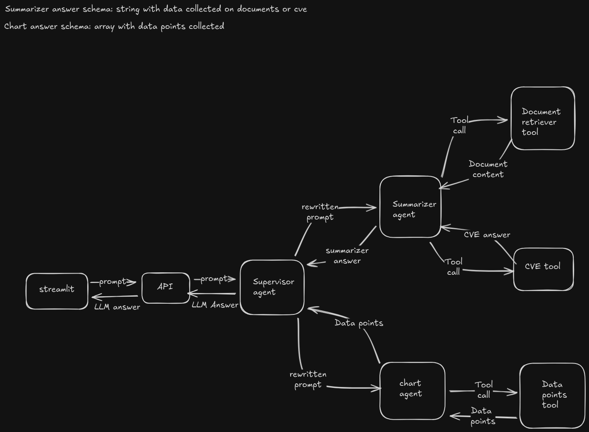

# QA agent

This project consists of a api that manages a multi-agent system:

## Architecture:

This project has an api that will send a prompt for the main agent and them it will answer the user

supervisor agent: Agent responsible to rewrite the prompt for tool calling the other two agents
summarizer agent: Agent with access based on user access in QA-dashboard
graph agent: Agent responsible for retrieving data points to generate the graph

